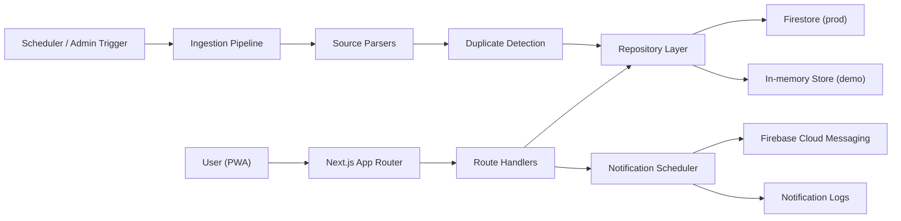

# Architecture Diagram

```mermaid
flowchart LR
  U["User (PWA)"] --> N["Next.js App Router"]
  N --> API["Route Handlers"]
  API --> REPO["Repository Layer"]
  REPO --> FS["Firestore (prod)"]
  REPO --> MOCK["In-memory Store (demo)"]

  CRON["Scheduler / Admin Trigger"] --> ING["Ingestion Pipeline"]
  ING --> PARSE["Source Parsers"]
  PARSE --> DEDUPE["Duplicate Detection"]
  DEDUPE --> REPO

  API --> NOTI["Notification Scheduler"]
  NOTI --> FCM["Firebase Cloud Messaging"]
  NOTI --> LOGS["Notification Logs"]
```
